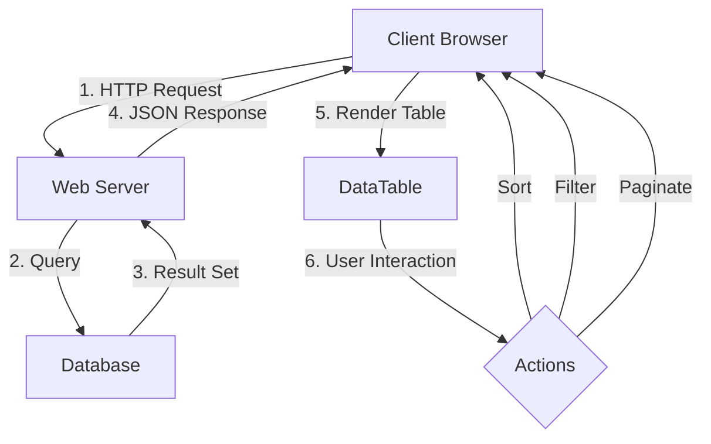

# JavaScript DataTables Guide

## Table of Contents
- [JavaScript DataTables Guide](#javascript-datatables-guide)
  - [Overview](#overview)
  - [Prerequisites](#prerequisites)
  - [Installation and Setup](#installation-and-setup)
  - [Data Flow Architecture](#data-flow-architecture)
  - [Basic Setup](#basic-setup)
  - [Loading Data from JSON/PHP](#loading-data-from-jsonphp)
  - [Database Integration](#database-integration)
  - [Python Implementations](#python-implementations)
  - [Getting Started](#getting-started)
  - [Features and Advanced Usage](#features-and-advanced-usage)
  - [Security Considerations](#security-considerations)
  - [Performance Optimization](#performance-optimization)
  - [Testing Strategies](#testing-strategies)
  - [Troubleshooting](#troubleshooting)
  - [Integration Points](#integration-points)
  - [Best Practices](#best-practices)
  - [Next Steps](#next-steps)

## Overview
This guide provides comprehensive examples of using DataTables with different backend implementations. DataTables is a powerful jQuery plugin for adding advanced interaction controls to HTML tables, supporting features like pagination, instant search, and multi-column ordering.

## Prerequisites
- Basic understanding of HTML, CSS, and JavaScript
- Familiarity with jQuery
- Knowledge of backend development (PHP, Python, or similar)
- Basic database concepts
- Understanding of REST APIs

## Installation and Setup
1. Package Manager (recommended):
```bash
npm install datatables.net
# or
yarn add datatables.net
```

2. CDN Links (alternative):
```html
<!-- CSS -->
<link rel="stylesheet" type="text/css" href="https://cdn.datatables.net/1.13.7/css/jquery.dataTables.css">
<link rel="stylesheet" type="text/css" href="https://cdn.datatables.net/buttons/2.4.2/css/buttons.dataTables.min.css">

<!-- JavaScript -->
<script type="text/javascript" src="https://code.jquery.com/jquery-3.7.0.min.js"></script>
<script type="text/javascript" src="https://cdn.datatables.net/1.13.7/js/jquery.dataTables.min.js"></script>
<script type="text/javascript" src="https://cdn.datatables.net/buttons/2.4.2/js/dataTables.buttons.min.js"></script>
```

## Data Flow Architecture



[Previous content remains the same through "Advanced Features" section...]

## Security Considerations
1. Input Validation
   - Sanitize all user inputs
   - Use prepared statements for SQL queries
   - Implement CSRF protection
   - Validate file uploads

2. Authentication & Authorization
   - Implement proper user authentication
   - Use role-based access control
   - Secure API endpoints
   - Handle session management

3. Data Protection
   - Encrypt sensitive data
   - Implement proper error handling
   - Use HTTPS
   - Follow data privacy regulations

## Performance Optimization
1. Server-side Processing
   - Implement efficient pagination
   - Use proper indexing
   - Cache frequently accessed data
   - Optimize SQL queries

2. Client-side Optimization
   - Minimize DOM manipulation
   - Use efficient event handlers
   - Implement lazy loading
   - Optimize JavaScript code

3. Network Optimization
   - Compress responses
   - Minimize payload size
   - Use CDN for assets
   - Implement proper caching

## Testing Strategies
1. Unit Testing
```javascript
describe('DataTable Initialization', () => {
    it('should initialize with default options', () => {
        const table = $('#myTable').DataTable();
        expect(table).toBeDefined();
        expect(table.page.info().length).toBe(10);
    });
});
```

2. Integration Testing
```python
def test_api_endpoint():
    response = client.get('/api/data')
    assert response.status_code == 200
    assert 'data' in response.json()
```

3. End-to-End Testing
```javascript
describe('DataTable E2E', () => {
    it('should perform search and filter', () => {
        cy.get('.dataTables_filter input')
            .type('test')
        cy.get('table tbody tr')
            .should('have.length.gt', 0)
    });
});
```

## Troubleshooting
1. Common Issues
   - Table not initializing
   - Ajax loading errors
   - Styling conflicts
   - Performance problems

2. Debugging Tips
   - Check console errors
   - Verify data format
   - Test API endpoints
   - Monitor network requests

## Integration Points
1. Frontend Frameworks
   - React integration
   - Vue.js integration
   - Angular integration

2. Backend Services
   - REST API integration
   - GraphQL integration
   - WebSocket integration

3. External Systems
   - Export to Excel/PDF
   - Email integration
   - Third-party APIs

## Best Practices
1. Code Organization
   - Modular structure
   - Clean code principles
   - Proper error handling
   - Documentation

2. Performance
   - Server-side processing for large datasets
   - Proper indexing
   - Caching strategies
   - Optimized queries

3. User Experience
   - Responsive design
   - Accessibility
   - Clear error messages
   - Loading indicators

## Next Steps
1. Advanced Features
   - Custom plugins development
   - Complex filtering
   - Custom rendering
   - State management

2. Scaling Considerations
   - Load balancing
   - Horizontal scaling
   - Caching strategies
   - Performance monitoring

3. Additional Resources
   - Official documentation
   - Community forums
   - Video tutorials
   - Sample projects
