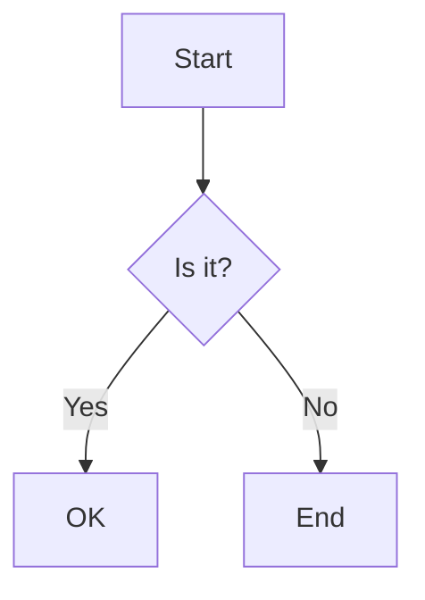
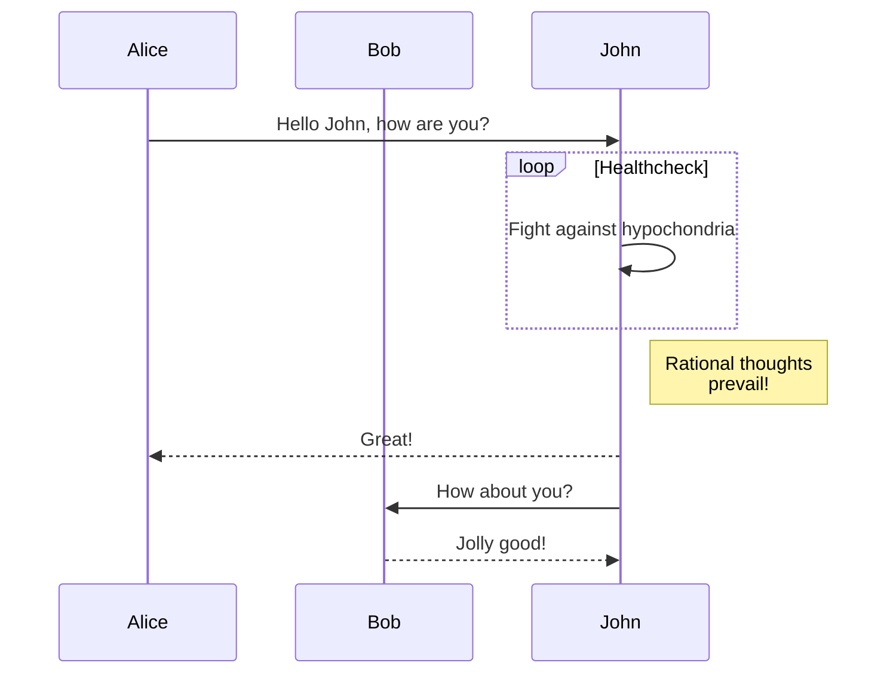
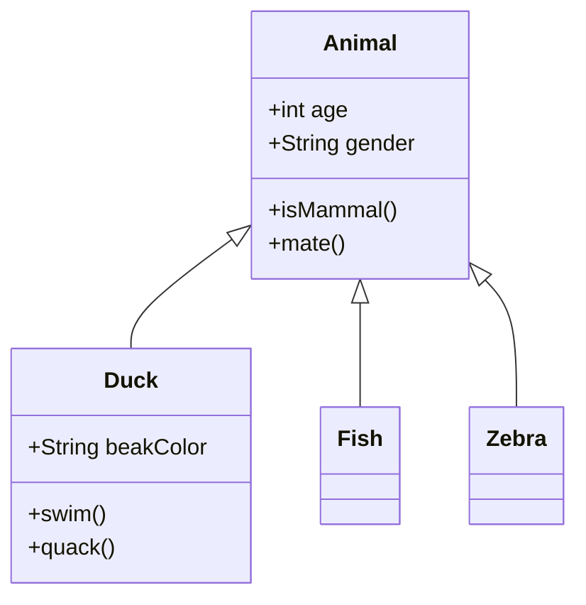
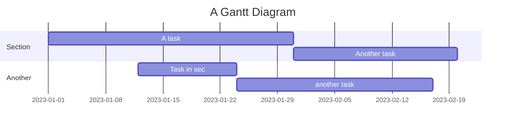
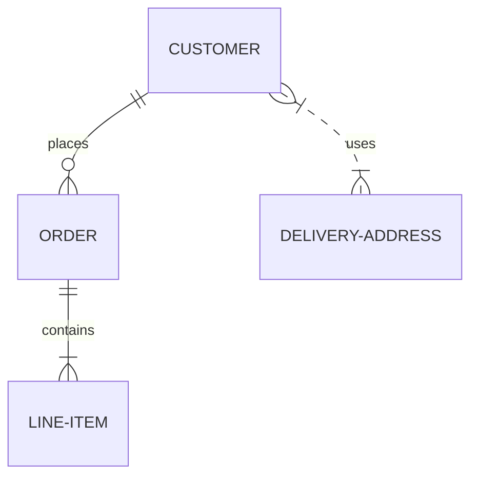
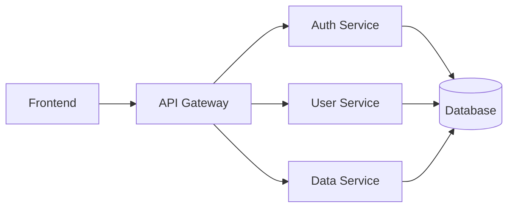
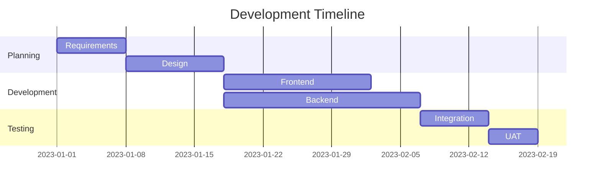

# Markdown and Mermaid Guide

## Table of Contents
- [Markdown and Mermaid Guide](#markdown-and-mermaid-guide)
  - [Table of Contents](#table-of-contents)
  - [Basic Markdown Syntax](#basic-markdown-syntax)
    - [Headers](#headers)
- [H1 Header](#h1-header)
  - [H2 Header](#h2-header)
    - [H3 Header](#h3-header)
      - [H4 Header](#h4-header)
        - [H5 Header](#h5-header)
          - [H6 Header](#h6-header)
    - [Emphasis](#emphasis)
    - [Lists](#lists)
    - [Links and Images](#links-and-images)
    - [Code](#code)
    - [Tables](#tables)
    - [Blockquotes](#blockquotes)
  - [Advanced Markdown Features](#advanced-markdown-features)
    - [Task Lists](#task-lists)
    - [Footnotes](#footnotes)
    - [Definition Lists](#definition-lists)
    - [Emoji](#emoji)
  - [Mermaid Diagrams](#mermaid-diagrams)
    - [Flowchart](#flowchart)
    - [Sequence Diagram](#sequence-diagram)
    - [Class Diagram](#class-diagram)
    - [Gantt Chart](#gantt-chart)
    - [Entity Relationship Diagram](#entity-relationship-diagram)
  - [Examples](#examples)
    - [Project Architecture](#project-architecture)
    - [Development Timeline](#development-timeline)
    - [Component Interaction](#component-interaction)

## Basic Markdown Syntax

### Headers
```markdown
# H1 Header
## H2 Header
### H3 Header
#### H4 Header
##### H5 Header
###### H6 Header
```

### Emphasis
```markdown
*Italic text* or _italic text_
**Bold text** or __bold text__
***Bold and italic*** or ___bold and italic___
~~Strikethrough text~~
```

### Lists
```markdown
1. Ordered list item 1
2. Ordered list item 2
   1. Nested ordered item
   2. Another nested item

- Unordered list item
* Another unordered item
  - Nested unordered item
  * Another nested item
```

### Links and Images
```markdown
[Link text](https://example.com)

```

### Code
```markdown
Inline `code` with backticks

\```python
def hello_world():
    print("Hello, World!")
\```
```

### Tables
```markdown
| Header 1 | Header 2 |
|----------|----------|
| Cell 1   | Cell 2   |
| Cell 3   | Cell 4   |
```

### Blockquotes
```markdown
> This is a blockquote
> Multiple lines
>> Nested blockquotes
```

## Advanced Markdown Features

### Task Lists
```markdown
- [x] Completed task
- [ ] Incomplete task
- [ ] Another task
```

### Footnotes
```markdown
Here's a sentence with a footnote[^1].

[^1]: This is the footnote content.
```

### Definition Lists
```markdown
Term
: Definition
```

### Emoji
```markdown
:smile: :heart: :thumbsup:
```

## Mermaid Diagrams

Mermaid is a powerful diagramming tool that allows you to create diagrams using text and code. Here are some examples:

### Flowchart


### Sequence Diagram


### Class Diagram


### Gantt Chart


### Entity Relationship Diagram


## Examples

Here's a practical example combining various Markdown and Mermaid features:

### Project Architecture


### Development Timeline


### Component Interaction
```mermaid
sequenceDiagram
    participant U as User
    participant F as Frontend
    participant A as API
    participant D as Database
    U->>F: Interact with UI
    F->>A: API Request
    A->>D: Query Data
    D-->>A: Return Results
    A-->>F: API Response
    F-->>U: Update UI
